<div align="center">

```
███╗   ██╗███████╗██╗   ██╗██████╗  ██████╗ ████████╗██╗    ██╗██╗███╗   ██╗
████╗  ██║██╔════╝██║   ██║██╔══██╗██╔═══██╗╚══██╔══╝██║    ██║██║████╗  ██║
██╔██╗ ██║█████╗  ██║   ██║██████╔╝██║   ██║   ██║   ██║ █╗ ██║██║██╔██╗ ██║
██║╚██╗██║██╔══╝  ██║   ██║██╔══██╗██║   ██║   ██║   ██║███╗██║██║██║╚██╗██║
██║ ╚████║███████╗╚██████╔╝██║  ██║╚██████╔╝   ██║   ╚███╔███╔╝██║██║ ╚████║
╚═╝  ╚═══╝╚══════╝ ╚═════╝ ╚═╝  ╚═╝ ╚═════╝    ╚═╝    ╚══╝╚══╝ ╚═╝╚═╝  ╚═══╝
```

### **PTSD Digital Brain Twin · Clinical AI Platform**
*Offline Reinforcement Learning × Latent State Drift Tracking × Explainable Clinical AI*

---

[](https://python.org)
[](https://pytorch.org)
[](https://huggingface.co/docs/peft)
[](https://shap.readthedocs.io)
[](LICENSE)
[](.)

</div>

---

## 📌 Overview

> **NeuroTwin** is a full-stack clinical AI research platform that constructs **individualized digital brain twins** for PTSD patients using parameter-efficient deep learning. It combines **β-VAE latent state modelling**, **Conservative Q-Learning (CQL) offline reinforcement learning**, and **SHAP-based explainability** to recommend optimal neurofeedback or motor-imagery intervention protocols — verified by a **Human-in-the-Loop (HITL) clinical auditor**.

```
┌─────────────────────────────────────────────────────────────────────────┐
│                          NeuroTwin Pipeline                             │
│                                                                         │
│   Raw EEG/Clinical Data                                                 │
│          │                                                              │
│          ▼                                                              │
│   ┌─────────────┐    ┌──────────────┐    ┌────────────────────────┐   │
│   │  β-VAE      │───▶│  LoRA Patient│───▶│  CQL Offline RL        │   │
│   │  Backbone   │    │  Adaptation  │    │  Policy Network        │   │
│   │  (Z=16)     │    │  (Per-Twin)  │    │  Q(s,a) → NF/MI/CTRL  │   │
│   └─────────────┘    └──────────────┘    └────────────────────────┘   │
│          │                  │                        │                  │
│          ▼                  ▼                        ▼                  │
│   Latent Drift        Twin Profile           ┌──────────────┐          │
│   Visualization       (29 patients)          │  SHAP XAI    │          │
│   (L2 Norm)                                  │  Attribution │          │
│                                              └──────────────┘          │
│                                                       │                 │
│                                              ┌──────────────┐          │
│                                              │   HITL Gate  │          │
│                                              │  Accept/Over │          │
│                                              │  ride/Defer  │          │
│                                              └──────────────┘          │
└─────────────────────────────────────────────────────────────────────────┘
```

---

## 🧠 Architecture

```mermaid
flowchart TD
    A[("📁 Raw Data\nEEG · Clinical · Mood")] --> B

    subgraph PHASE1 ["⚙️ Phase 1 — Foundation"]
        B["🔍 ID Alignment\nVerification"] --> C["🔄 Data Ingestion\nPipeline"]
        C --> D["🏆 Reward Prior\nTraining\nr = 0.4027"]
        D --> E["📊 Validation\nReport\nPearson Gate ✓"]
    end

    subgraph PHASE2 ["🧬 Phase 2 — LSDT + Offline RL"]
        F["🧠 LSDT Backbone\nPretrain\nβ-VAE · Z=16"] --> G["🔧 LoRA Patient\nAdaptation\n29 Adapters"]
        G --> H["🎯 CQL Offline RL\nPolicy Training\nQ-Values: NF/MI/CTRL"]
    end

    subgraph PHASE3 ["🏥 Phase 3 — Clinical Output"]
        I["📋 Clinical Output\nLayer"] --> J["🔬 SHAP\nExplainer\nKernelSHAP"]
        J --> K["👨‍⚕️ HITL Gate\nHuman Review\nAccept · Override · Defer"]
    end

    PHASE1 --> PHASE2
    PHASE2 --> PHASE3

    K --> L[("🌐 NeuroTwin\nDashboard\nLive Inference")]

    style PHASE1 fill:#0d2020,stroke:#00f2fe,stroke-width:2px,color:#d8e8e8
    style PHASE2 fill:#1a0d2e,stroke:#7f00ff,stroke-width:2px,color:#d8e8e8
    style PHASE3 fill:#0d2010,stroke:#00e676,stroke-width:2px,color:#d8e8e8
    style L fill:#001a20,stroke:#00f2fe,stroke-width:3px
```



---

## 📂 Project Structure

```
NeuroTwin/
│
├── 📁 src/                              # Core AI/ML Pipeline
│   ├── 🔍 id_alignment_verification.py  # Phase 1.1 — Cross-source ID audit
│   ├── 🔄 data_ingestion_pipeline.py    # Phase 1.2 — Unified patient records
│   ├── 🏆 reward_prior_training.py      # Phase 1.3 — Clinical reward model
│   ├── 📊 reward_prior_validation_report.py  # Phase 1.4 — Pearson r gate
│   ├── 📋 dataset_summary_report.py     # Phase 1.5 — Cohort statistics
│   │
│   ├── 🧠 lsdt_backbone_pretrain.py     # Phase 2.1 — β-VAE backbone
│   ├── 🔧 lora_patient_adaptation.py    # Phase 2.2 — Per-patient LoRA
│   ├── 🎯 cql_offline_rl.py             # Phase 2.3 — CQL policy network
│   │
│   ├── 📋 clinical_output_layer.py      # Phase 3.1 — Final predictions
│   ├── 🔬 shap_explainer.py             # Phase 3.2 — SHAP feature attribution
│   └── 👨‍⚕️ hitl_gate.py                  # Phase 3.3 — Human-in-the-loop review
│
├── 📁 dashboard/                        # Clinical AI Web Interface
│   ├── 🌐 index.html                    # NeuroTwin UI (glassmorphism design)
│   ├── 🎨 index.css                     # Premium dark design system
│   └── ⚡ app.js                         # Interactive dashboard controller
│
├── 📁 data/                             # Raw research datasets (gitignored)
│   ├── CI_raw-data-scores.xlsx
│   ├── mood-stress-data.xlsx
│   ├── NF_datasheets.xlsx
│   └── MI_datasheets.xlsx
│
├── 📁 models/                           # Trained model checkpoints
├── 📁 outputs/                          # Generated reports & plots
├── 📁 scripts/                          # Utility scripts
│
├── 🚀 run_pipeline.py                   # Full pipeline runner
├── 🖥️  serve_dashboard.py               # Local dashboard server
└── 📦 requirements.txt                  # Python dependencies
```

---

## 🔬 Technical Deep-Dive

### 1️⃣ Latent State Digital Twin (LSDT)

```
Patient EEG Sessions
        │
        ▼
┌───────────────────────────────────────────────────────┐
│              β-Variational Autoencoder                 │
│                                                       │
│  Encoder                          Decoder             │
│  ─────────────────                ──────────────────  │
│  [Session State Vec]              [Reconstructed Vec] │
│       │                                  ▲            │
│       ▼                                  │            │
│  FC(128→64) ──► μ, σ ──► z ────────────►│            │
│                     ↑                                 │
│            Latent Dim Z=16                            │
│        KL Divergence + Recon Loss                     │
└───────────────────────────────────────────────────────┘
        │
        ▼
  L2 Norm Drift (per session) → Trajectory to Healthy State
```

### 2️⃣ LoRA Patient Adaptation

| Parameter | Value |
|-----------|-------|
| Base Model | LSDT Backbone (β-VAE) |
| Adapter Type | LoRA (Low-Rank Adaptation) |
| Rank | r = 4 |
| Patients | 29 individualized adapters |
| Training | Per-twin fine-tuning on session sequences |

### 3️⃣ CQL Offline Reinforcement Learning

```
State Space (s):  Session State Vector (EEG + clinical features)
                        │
                        ▼
               ┌─────────────────┐
               │   Q-Network     │
               │   FC(128→64)    │
               │   FC(64→32)     │
               │   FC(32→3)      │
               └─────────────────┘
                        │
              ┌─────────┼─────────┐
              ▼         ▼         ▼
         Q(s, NF)  Q(s, MI)  Q(s, CTRL)
         Neurofeed  Motor     No EEG
         back       Imagery   Intervention

CQL Objective: min Q(s,a) for out-of-distribution actions
               + standard Bellman error
```

### 4️⃣ Reward Prior Model

```
Input: [PCL-5 pre, WEMWBS pre, n_sessions, group_encoded, ...]
                        │
                        ▼
              Neural Network Regressor
                        │
                        ▼
Output: Predicted Reward (clinical outcome proxy)

Validation:  Pearson r = 0.4027  ✅ (Gate threshold: r ≥ 0.40)
             Val subset r = 0.4866
             Training arms: 1,326
```

---

## 📊 Results & Performance

```
┌─────────────────────────────────────────────────────────────────┐
│                    Cohort Performance Metrics                   │
├──────────────────────┬──────────────────────────────────────────┤
│ Metric               │ Value                                    │
├──────────────────────┼──────────────────────────────────────────┤
│ Total Patients       │ 29  (NF: 10 · MI: 10 · Control: 9)      │
│ Model Accuracy       │ 55.6% (above random baseline)            │
│ Reward Prior r       │ 0.4027 ✅ (Gate passed)                  │
│ Validation r         │ 0.4866                                   │
│ Latent Dimension     │ Z = 16 (β-VAE)                          │
│ Active LoRA Adapters │ 20 configured                            │
│ Cohort Dropout Risk  │ 25% (2 High · 5 Medium · 22 Low)        │
├──────────────────────┼──────────────────────────────────────────┤
│ NF Group PCL-5 Δ     │ +0.185 ± 0.227                          │
│ MI Group PCL-5 Δ     │ −1.368 ± 0.166 ✨                       │
│ Control PCL-5 Δ      │ −0.401 ± 0.121                          │
└──────────────────────┴──────────────────────────────────────────┘
```

---

## 🚀 Quick Start

### Prerequisites

```bash
Python >= 3.10
CUDA-compatible GPU (recommended)
```

### Installation

```bash
# 1. Clone the repository
git clone https://github.com/amribrahim11vv/NeuroTwin.git
cd NeuroTwin

# 2. Create virtual environment
python -m venv .venv
source .venv/bin/activate          # Linux/macOS
.venv\Scripts\activate             # Windows

# 3. Install dependencies
pip install -r requirements.txt
```

### Run the Full Pipeline

```bash
# Run all 3 phases sequentially
python run_pipeline.py

# Run a specific phase only
python run_pipeline.py --phase 1   # Foundation
python run_pipeline.py --phase 2   # LSDT + Offline RL
python run_pipeline.py --phase 3   # Clinical Output
```

### Launch the Dashboard

```bash
python serve_dashboard.py
# → Open: http://localhost:8080
```

---

## 🧪 Pipeline Phases

```mermaid
gantt
    title NeuroTwin Pipeline Execution Sequence
    dateFormat X
    axisFormat Step %s

    section Phase 1 — Foundation
    ID Alignment Verification     :done, p1a, 1, 2
    Data Ingestion Pipeline        :done, p1b, 2, 4
    Reward Prior Training          :done, p1c, 4, 6
    Validation Report              :done, p1d, 6, 7
    Dataset Summary                :done, p1e, 7, 8

    section Phase 2 — LSDT + RL
    LSDT Backbone Pretrain         :active, p2a, 8, 11
    LoRA Patient Adaptation        :active, p2b, 11, 14
    CQL Offline RL Training        :active, p2c, 14, 17

    section Phase 3 — Clinical
    Clinical Output Layer          :p3a, 17, 19
    SHAP Explainer                 :p3b, 19, 21
    HITL Gate Review               :p3c, 21, 22
```



---

## 🌐 Dashboard

The NeuroTwin clinical dashboard provides a real-time interface built with a premium dark glassmorphism design system.

```
┌──────────────────────────────────────────────────────────────────┐
│  🧠 NeuroTwin                        ● AI Live Inference  🔔    │
│  PTSD Clinical AI                                                │
│  ─────────────────                                               │
│  📊 Dashboard    │   ┌────────────────────────────────────────┐  │
│  🧬 Patient      │   │  NeuroTwin · PTSD Clinical AI          │  │
│     Explorer     │   │  ════════════════════════════════════  │  │
│  🔬 Explainable  │   │  29 patients · NF · MI · Control       │  │
│     AI           │   └────────────────────────────────────────┘  │
│                  │                                                │
│  ● Engine Online │   ┌──────────────┐  ┌────────────────────┐   │
│  NeuroTwin-RL-   │   │  PCL-5 Δ     │  │  NeuroTwin Copilot │   │
│  v4.2            │   │  Bar Chart   │  │  RAG Assistant     │   │
│                  │   └──────────────┘  └────────────────────┘   │
│  DR. ARIS        │                                                │
│  Level 4 Auth    │   ┌──────────────────────────────────────┐   │
└──────────────────┘   │  Patient Explorer · Q-Values · HITL   │   │
                        └──────────────────────────────────────┘   │
```

### Dashboard Features

| Feature | Description |
|---------|-------------|
| 🧠 **Brain Twin Workspace** | Real-time L2 norm latent drift trajectory per patient |
| 🎯 **RL Decision Matrix** | CQL Q-value bars for NF / MI / CONTROL actions |
| 🔬 **SHAP Attribution** | KernelSHAP feature importance heatmap |
| 🤖 **NeuroTwin Copilot** | RAG-based clinical assistant with quick prompts |
| 👨‍⚕️ **HITL Auditor** | Accept / Override / Defer with clinician notes |
| 📊 **Cohort Overview** | Group comparison charts & dropout risk gauge |

---

## 🔐 Security

All security fixes applied per PASS 2 audit:

- ✅ `torch.load(..., weights_only=True)` enforced across all model loading
- ✅ XSS-safe DOM rendering (all user input via `textContent`, no `innerHTML`)
- ✅ No hardcoded secrets or API keys in codebase
- ✅ Path sanitization in `serve_dashboard.py`

---

## 📦 Dependencies

| Package | Version | Purpose |
|---------|---------|---------|
| `torch` | ≥ 2.0.0 | β-VAE, CQL Q-Network, LoRA |
| `peft` | ≥ 0.5.0 | LoRA patient adaptation |
| `transformers` | ≥ 4.32.0 | Model utilities |
| `shap` | ≥ 0.42.0 | KernelSHAP explainability |
| `scikit-learn` | ≥ 1.3.0 | Reward prior, preprocessing |
| `pandas` | ≥ 2.0.0 | Clinical data processing |
| `numpy` | ≥ 1.24, < 2.0 | Numerical operations |
| `scipy` | ≥ 1.10.0 | Statistical validation |
| `matplotlib` | ≥ 3.7.0 | Plot generation |
| `seaborn` | ≥ 0.12.0 | Visualization styling |

---

## 🗺️ Roadmap

```
v1.0  ████████████████████  ✅  Core pipeline (Phase 1–3)
v1.1  ████████████████░░░░  ✅  HITL web dashboard
v1.2  ████████████░░░░░░░░  🔄  Real-time EEG streaming integration
v2.0  ██████░░░░░░░░░░░░░░  📅  Federated learning (multi-site)
v2.1  ███░░░░░░░░░░░░░░░░░  📅  Foundation Model backbone
v3.0  █░░░░░░░░░░░░░░░░░░░  💡  Closed-loop neurofeedback control
```

---

## 📄 Citation

If you use **NeuroTwin** in your research, please cite:

```bibtex
@software{neurotwin2026,
  title   = {NeuroTwin: A PTSD Digital Brain Twin Platform with
             Offline Reinforcement Learning and Clinical AI},
  author  = {Amr Ibrahim},
  year    = {2026},
  url     = {https://github.com/amribrahim11vv/NeuroTwin},
  version = {v1.1},
  note    = {Conservative Q-Learning · β-VAE Latent States ·
             LoRA Adaptation · SHAP Explainability · HITL Gate}
}
```

---

## ⚠️ Disclaimer

> This platform is developed for **academic and clinical research purposes only**. It is **not** a certified medical device. All AI recommendations must be reviewed and validated by qualified clinicians before clinical application. The HITL gate is a mandatory safeguard and must not be bypassed in clinical settings.

---

<div align="center">

```
        ╔══════════════════════════════════════════╗
        ║  Built with ❤️  for PTSD Research         ║
        ║  NeuroTwin · PTSD Clinical AI Platform   ║
        ║  β-VAE · CQL · LoRA · SHAP · HITL        ║
        ╚══════════════════════════════════════════╝
```

**[Dashboard](dashboard/index.html)** · **[Pipeline](run_pipeline.py)** · **[Docs](src/)**

---

*by **Amr Ibrahim** · [GitHub @amribrahim11vv](https://github.com/amribrahim11vv)*

</div>
